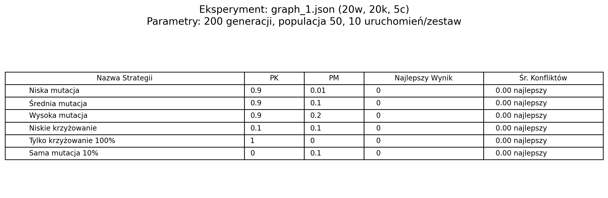
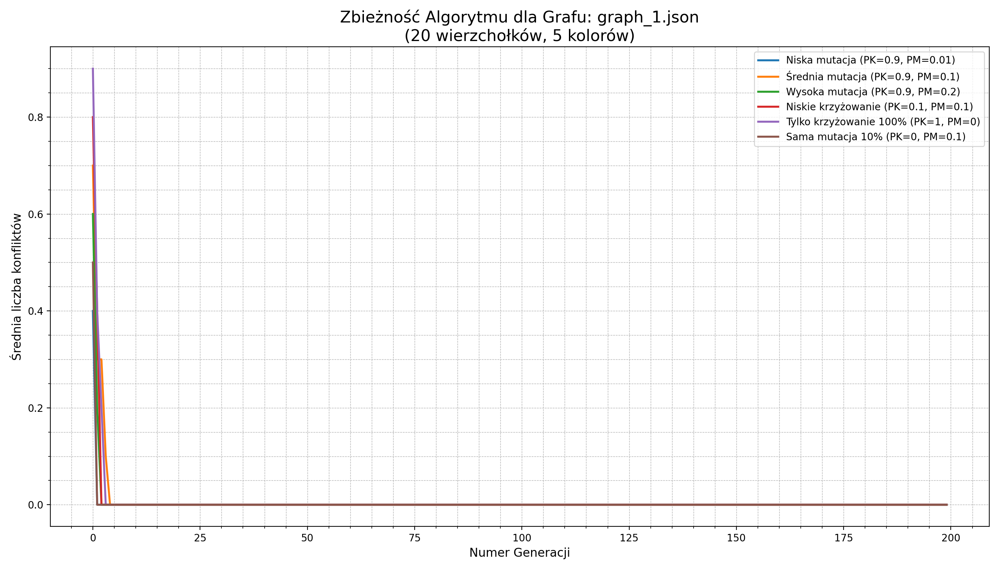
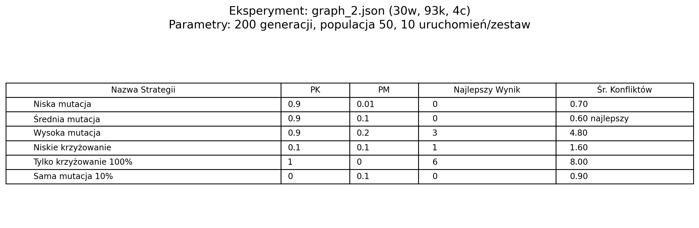
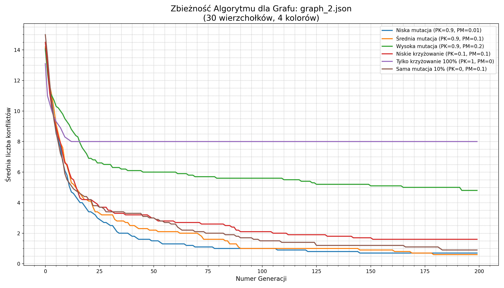
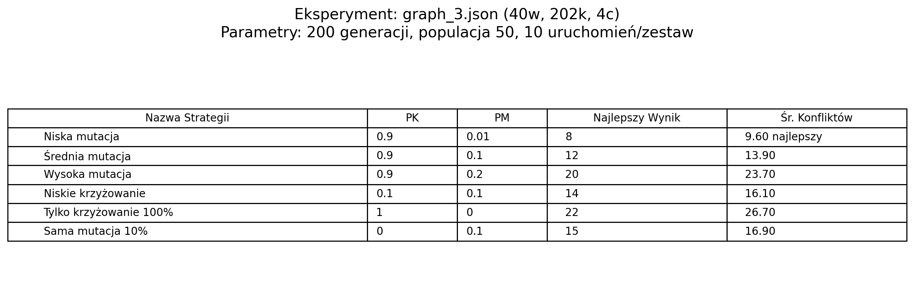
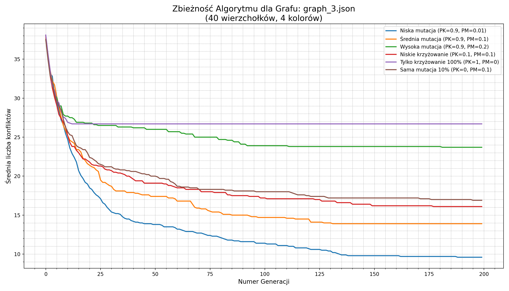
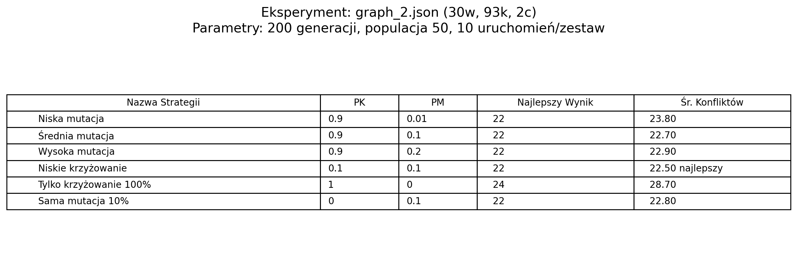
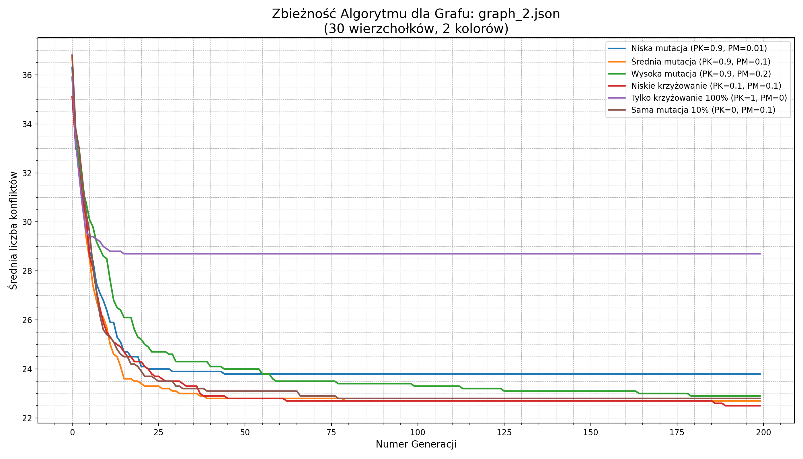
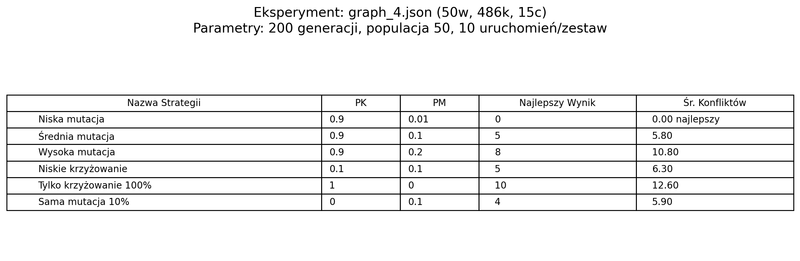
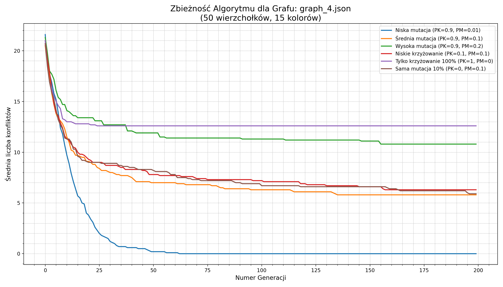

# Wyniki Eksperymentów GA - Kolorowanie Grafu

## Informacje Ogólne

* **Algorytm:** Podstawowy Algorytm Genetyczny
* **Operatory:** Krzyżowanie jednopunktowe, Mutacja
* **Selekcja:** Turniejowa (rozmiar turnieju: 5)
* **Parametry Główne:**
    * Rozmiar populacji: 50
    * Liczba generacji: 200
    * Liczba uruchomień na strategię: 10
* **Testowane Strategie:**
    1.  `Zbalansowana` (PK=0.9, PM=0.1)
    2.  `Wysoka Eksploatacja` (PK=0.9, PM=0.01)
    3.  `Wysoka Eksploracja` (PK=0.9, PM=0.2)
    4.  `Tylko Krzyżowanie` (PK=1, PM=0)
    5.  `Tylko Mutacja` (PK=0, PM=0.1)

---

## Test 1:

* **Graf:** `grafy/graph_1.json`
* **Wierzchołki:** 20
* **Krawędzie:** 20
* **Kolory:** 5

### Tabela Wyników

### Wykres Zbieżności

---

## Test 2:

* **Graf:** `grafy/graph_2.json`
* **Wierzchołki:** 30
* **Krawędzie:** 93
* **Kolory:** 4

### Tabela Wyników

### Wykres Zbieżności

---

## Test 3:

* **Graf:** `grafy/graph_3.json`
* **Wierzchołki:** 40
* **Krawędzie:** 202
* **Kolory:** 4

### Tabela Wyników

### Wykres Zbieżności

---

## Test 4:

* **Graf:** `grafy/graph_2.json`
* **Wierzchołki:** 30
* **Krawędzie:** 93
* **Kolory:** 2

### Tabela Wyników

### Wykres Zbieżności

---

## Test 5:
* **Graf:** `grafy/graph_4.json`
* **Wierzchołki:** 50
* **Krawędzie:** 486
* **Kolory:** 15

### Tabela Wyników

### Wykres Zbieżności

